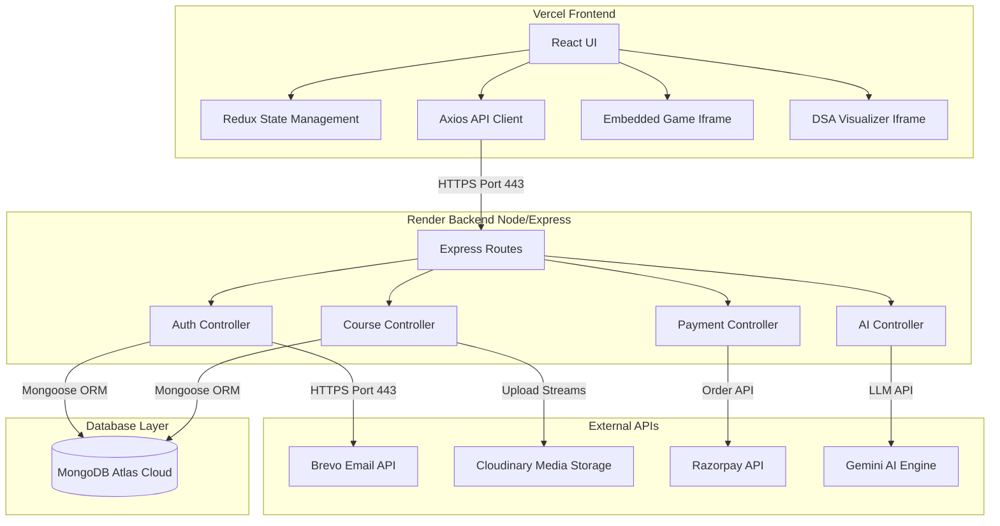

# 🚀 Codeverse - Interactive Fullstack Learning & Coding Sandbox Platform

[](https://code-verse-lweh.vercel.app/)
[](https://github.com/piyush5093/CodeVerse)

**Codeverse** is a state-of-the-art MERN stack educational platform designed for modern software engineering students. It bridges the gap between theoretical courses and hands-on coding by integrating an interactive **DSA Visualizer Sandbox**, an embedded **Programming Adventure Game**, a secure **Razorpay Checkout Gateway**, and a **Context-Aware AI Tutor** that helps students review and optimize code dynamically.

---

## 🎨 Key Architectural Pillars & Features

### 1. 🤖 Context-Aware AI Chatbot & Doubt Solver
*   **Engine:** Powered by the **Gemini AI API** (`gemini-pro`).
*   **State-Awareness:** Automatically inspects the React Router `pathname` to detect if the user is studying a specific course (e.g., Python, JavaScript) and dynamically feeds that context to the AI model.
*   **Features:** Provides onboarding suggestions, syntax-highlighted code blocks, formatted markdown checklists, and a premium glassmorphic chat interface.

### 2. 📊 Interactive DSA Visualizer Sandbox
*   **Visual Sandbox:** Seamlessly embeds a dedicated algorithm sandbox inside the main application viewport.
*   **Algorithms Covered:** Supports sorting algorithms, graph pathfinding, trees, and linked list traversals.
*   **Visual UI:** Includes dynamic execution speed sliders, code-line highlighting, and custom controls.

### 3. 🎮 Embedded Codeverse Adventure Game
*   **Integration:** Integrates `https://codeverse-adventure.vercel.app` natively using a viewport-fitted iframe wrapper.
*   **Fluid Sizing:** Automatically calculates remaining screen height to eliminate double scrollbars, adapting whether it is viewed publicly or inside the Student/Instructor Dashboard.
*   **Fullscreen Mode:** Custom fullscreen API toggle button lets developers play distraction-free.

### 4. 💳 Razorpay UPI & Card Payment Gateway
*   **Checkout Engine:** Connects to the Razorpay SDK to create dynamic order IDs, manage checkout transactions, and handle secure signatures on the backend.
*   **UPI Priority:** Styled and configured display blocks to prioritize UPI payment options.
*   **Dynamic Key Loading:** Backend dynamically returns public merchant keys during order creation, allowing the frontend to load the gateway with zero Vercel env-variable configuration.

### 5. 📧 Fail-Safe Outbound Email & OTP Verification
*   **Mailing Engine:** Powered by **Brevo (formerly Sendinblue) HTTPS REST API** over port 443.
*   **SMTP Fallback:** Features a custom fail-safe mechanism in Nodemailer (trying port 465 SSL, falling back to port 587 TLS).
*   **Non-Blocking OTP Logs:** If SMTP connection times out (common on Render's free tier due to port blocks), the backend catches the error, saves the OTP to the database, prints a fallback code in the logs, and proceeds without crashing.

---

## 🛠️ Technology Stack

| Layer | Technologies |
| :--- | :--- |
| **Frontend** | React.js (v18), Redux Toolkit (State Management), React Router DOM (v6), Tailwind CSS (Aesthetic styling), Framer Motion (Animations), Axios |
| **Backend** | Node.js, Express.js, MongoDB Atlas (Database), Mongoose ORM, Nodemailer, JWT (Auth Tokens), Cookie-Parser |
| **Media Pipeline** | Cloudinary SDK (Promise-wrapped upload streams) |
| **Hosting & CI/CD** | **Vercel** (Frontend Hosting), **Render** (Backend Hosting), **Brevo API** (Transactional Emails) |

---

## 📐 System Architecture Diagram



---

## ⚙️ Environment Variables Config

### Backend Configuration (`server/.env`)
```env
PORT=4000
MONGODB_URL=your_mongodb_atlas_connection_string
JWT_SECRET=your_jwt_signing_secret
GEMINI_API_KEY=your_gemini_api_key

# Brevo Configuration (HTTPS REST API / SMTP Fallback)
MAIL_HOST=smtp-relay.brevo.com
MAIL_USER=your_brevo_registration_email
MAIL_PASS=your_brevo_api_key_starting_with_xkeysib-

# Razorpay Configuration
RAZORPAY_KEY=your_razorpay_public_key
RAZORPAY_SECRET=your_razorpay_secret_key

# Cloudinary Configuration
CLOUD_NAME=your_cloudinary_cloud_name
API_KEY=your_cloudinary_api_key
API_SECRET=your_cloudinary_api_secret
FOLDER_NAME=Codeverse
```

### Frontend Configuration (Vercel)
```env
REACT_APP_BASE_URL=https://codeverse-backend-774v.onrender.com/api/v1
CI=false
```

---

## 🚀 Getting Started Locally

1.  **Clone the Repository:**
    ```bash
    git clone https://github.com/piyush5093/CodeVerse.git
    cd CodeVerse
    ```

2.  **Setup Backend env:**
    Create a `.env` file in the `server` directory and paste your configuration keys.

3.  **Install & Run concurrently:**
    Install dependencies for both folders and start the development servers:
    ```bash
    npm install
    cd server && npm install
    cd ..
    npm run dev
    ```
    Your client will run at `http://localhost:3000` and the server at `http://localhost:4000`.

---

## 👨‍💻 Author & Contributions

*   **Piyush Patil** - Lead Fullstack Developer - [GitHub](https://github.com/piyush5093)
*   Deployments: [Frontend Site](https://code-verse-lweh.vercel.app/) | [Backend Server](https://codeverse-backend-774v.onrender.com)
